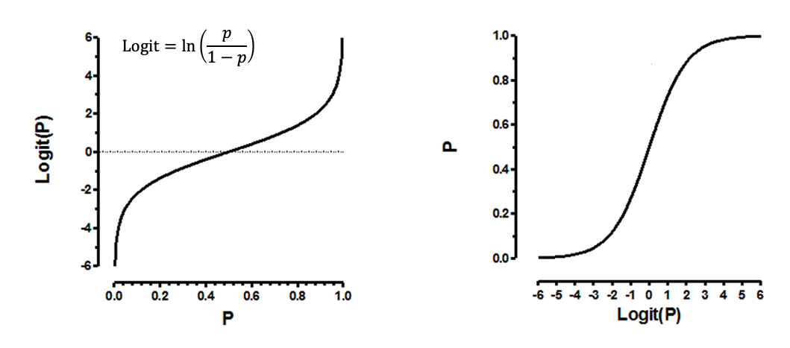

```{r setup, include=FALSE}
knitr::opts_chunk$set(echo = TRUE)

options(scipen=999)
options(digits = 3)

library(tidyverse)
library(sf)
library(here)
library(kableExtra)
library(patchwork)
library(gmodels)
library(ggcorrplot)
library(ROCR)
library(plotROC)

library(aod)
library(ggplot2)
library(rms)
library(gmodels)
library(nnet)
library(DAAG)
library(ROCR)
library(xtable)
```

```{r, include=FALSE}
crashes <- read.csv("data/Logistic_Regression_Data.csv")
```

# Introduction

Motor vehicle crashes remain one of the leading causes of injury and death in urban environments across the United States. Among these incidents, crashes involving alcohol-impaired drivers are particularly concerning because they account for a disproportionately high number of fatalities and severe injuries. According to national statistics, nearly one-third of all traffic-related deaths involve a driver under the influence of alcohol, underscoring the continued public health risks associated with impaired driving. In Philadelphia, where traffic density, roadway design, and neighborhood characteristics vary widely, it is especially important to understand the factors that contribute to alcohol-related crashes. By identifying these factors, city officials and public health professionals can design more targeted interventions to reduce the prevalence and severity of such incidents. This analysis uses crash data from Philadelphia covering the years 2008 to 2012 to investigate how various characteristics of crashes and neighborhoods are associated with the presence of a drinking driver.

This study explores the factors associated with DUI in traffic crashes in Philadelphia by examining a set of binary and continuous predictors. These include indicators of crash severity (Crashes resulted in fatality or major injury), risky driving behaviors (Crashes involved an overturned vehicle, speeding car and aggressive driving or Driver was using cell phone), driver demographics (Crashes involved at least one driver who was 16 or 17 years old and Crashes involved at least one driver who was at least 65 years old), and neighborhood-level socioeconomic characteristics (percentage with bachelor’s degree or more, Median household income). Among them, crashes resulting in fatalities or major injuries are more likely to involve alcohol, as intoxicated drivers have slower reaction times and poorer judgment. Behaviors such as speeding, aggressive driving, and overturning are more common in high-risk situations often associated with alcohol impairment. Distractions like cellphone use may not be directly linked to alcohol use, but they reflect a broader disregard for road safety that might overlap with impaired driving tendencies. Age also plays a role as younger drivers (ages 16–17) are less experienced and may be more prone to risk-taking, while older drivers (65+) typically show lower alcohol involvement because of health concerns or lifestyle differences. Beyond driver behavior, neighborhood-level characteristics such as education and income may also influence the likelihood of alcohol-involved crashes. Areas with higher percentages of college-educated residents may have greater awareness of drunk driving risks. Wealthier neighborhoods might also exhibit lower rates of alcohol-related crashes as they have access to greater availability of resources and support systems.

In this report, we use R to perform logistic regression analysis, examining the statistical relationships between the selected predictors and the likelihood that a crash involved a drinking driver across Philadelphia.

# Method

## Issues with OLS Regression

The OLS regression model can be expressed as following formula:

$$
y = \beta_0 + \beta_1x_1 + \beta_2x_2 + ... + \beta_kx_k + \epsilon
$$

where:

- \(y\) is the dependent variable
- \(x_1, x_2, ..., x_k\) are the independent variables
- \(\beta_0, \beta_1, \beta_2, ..., \beta_k\) are the coefficients
- \(\epsilon\) is the error term

Using OLS regression to model binary outcomes can lead to several issues:

- First, in the OLS regression, \(\beta_1\) is interpreted as the amount of the dependent variable \(y\) changes when \(x_1\) increases by one unit, holding all other variables constant. However, when the dependent variable is binary, a one unit increase in \(x_1\) results in \(\beta_1\) increase in \(y\) no longer makes sense, as \(y\) can change only from 0 to 1 or from 1 to 0. This leads to some interpretation issues.
- Second, OLS regression assumes a linear relationship between the predictors and the dependent variable. With a binary dependent variable, this assumption no longer holds, as binary outcomes are inherently no linear.
- Third, OLS also assumes normally distributed residuals. However, with binary outcome, the residuals are not normally distributed. Instead, they follow a binomial distribution.
- Finally, OLS regression has another assumption of heteroscedasticity, which means that the variance of the residuals is constant across all levels of the independent variables. However, with binary outcomes, this assumption is violated, as the variance of the residuals is not constant. It varies with the predicted probability, leading to heteroscedasticity.

All those violations of the OLS regression assumptions affect the validity of the model and the interpretation of the coefficients. In this way, we need to use a different approach to model binary outcomes.

## Logistic Regression Concepts

Logistic regression provide a way for us to get around above-mentioned issues. Instead of predicting the the dependent variable \(y\) directly, logistic regression predicts the probability of the dependent variable \(y\) being equal to 1. This can be explained through the concept of odds. The **odds** of an event is a ratio that compares the likelihood of the event happening to the likelihood of it not happening. The odds of an event can be expressed as:

$$
\text{Odds} = \frac{\text{Probability of Event Happening}}{\text{Probability of Event Not Happening}} = \frac{p}{1 - p}
$$
Where \(p\) is the probability of the event happening. The odds can take any value from 0 to infinity, where 0 means the event will never happen and infinity means the event will always happen. For example, if there is a 60% of an event happening (probability\(p\)=0.6), the odds of the event would be:

$$
\text{Odds} = \frac{0.6}{1 - 0.6} = \frac{0.6}{0.4} = 1.5
$$
This mean the vent is 1.5 times more likely to happen than not happening. In logistic regression, instead of predicting the probability of the event directly, we predict the **log odds** (also known as **logit**) of the outcome. The logit model with multiple predictors is expressed as:

$$
\log \left( \frac{p}{1 - p} \right) = \beta_0 + \beta_1 x_1 + \beta_2 x_2 + \dots + \beta_k x_k
$$
In our specific case, it can be written as:
$$
\log \left( \frac{P(\text{DRINKING_D} = 1)}{1 - P(\text{DRINKING_D} = 1)} \right) = \beta_0 + \beta_1 \cdot \text{FATAL_OR_M} + \beta_2 \cdot \text{OVERTURNED} + \dots + \beta_9 \cdot \text{MEDHHINC}
$$

Where:

- \(P(\text{DRINKING_D} = 1)\) is the probability of a crash involving a drinking driver.
-  \( \log \left( \frac{P(\text{DRINKING_D} = 1)}{1 - P(\text{DRINKING_D} = 1)} \right) \) is the log-odds of drinking involvement.
- \( \beta_0 \) is the intercept of the model, representing the log-odds of drinking and drive involved when all predictors are zero
- \( \beta_1, \beta_2, \dots, \beta_k \) are the coefficients of each predictor variable, indicating the change in log-odds for a one unit increase in each predictors, holdings other constant.

The predictor variable in the model is defined as follows:

- `FATAL_OR_M`: whether the crash involved a fatality
- `OVERTURNED`: whether the crash involved an overturned vehicle
- `CELL_PHONE`: whether the driver was using a cell phone
- `SPEEDING`: whether the crash involved speeding
- `AGGRESSIVE`: whether the crash involved aggressive driving
- `DRIVER1617`: whether the crash involved at least one driver aged 16 or 17
- `DRIVER65PLUS`: whether the crash involved at least one driver aged 65 or older
- `PCTBACHMOR`: percentage of the population with a bachelor's degree or more
- `MEDHHINC`: median household income in the area

Logistic Function: The logistic function is the **inverse of the logit function**, as shown in following graph. It takes the linear predictor (log-odds) and transforms it into a probability value between 0 and 1 [0,1]. This transformation is ideal for modeling binary outcomes as it transforms the linear combination of predictors into a probability value.
```{r}

```
The logistic function is defined as:

$$
P(Y = 1) = \frac{1}{1 + e^{-(\beta_0 + \beta_1 x_1  + \beta_2 x_2 +  \dots + \beta_k x_k)}}
$$
In this specific case, it can be written as:

$$
P(\text{DRINKING_D} = 1) = \frac{1}{1 + e^{-(\beta_0 + \beta_1 \cdot \text{FATAL_OR_M} + \dots + \beta_9 \cdot \text{MEDHHINC})}}
$$
As shown in the graph above, the logistic function has an **S-shaped curve** with the following properties:

- **Outcome between 0 and 1 [0,1]**: As the linear predictor approaches negative infinity, the probability approaches 0. As the linear predictor approaches positive infinity, the probability approaches 1. This means that the predicted probabilities will always be between 0 and 1, making it suitable for binary outcomes.
- **Symmetric around 0.5**: The logistic function is symmetric around the point where the linear predictor equals 0.5. This means that when the linear predictor is equal to 0, the predicted probability is 0.5, indicating an equal chance of the event occurring or not occurring. This midpoint is useful in binary classification as it helps interpret probabilities around 50%.

Overall, the logistic function is the type of translator function we are ;ooking for. It works well for binary dependent variable because it restricts the predicted probabilities to the range of 0 and 1, which is essential for binary outcomes. Each coefficient \(\beta_i\) in the logistic regression model represents the effect of a predictor on the log-odds of the outcome, which can be transformed to interpret effects on probability.

## Logistic Regression Hypothesis

For each predictors in our logistic regression model, we test whether the predictor has a statistically significant effect on the outcome variable.

The **Null Hypothesis (\( H_0 \)), which states that the predictor has no effect on the outcome variable**. In other words, the coefficient of the predictor is equal to zero (\( \beta_i = 0 \)), writtern as:

$$
H_0 : \beta_i = 0
$$
The **Alternative Hypothesis (\( H_a \)), which states that the predictor has an effect on the outcome variable**. In other words, the coefficient of the predictor is not equal to zero (\( \beta_i \neq 0 \)), writtern as:

$$
H_0 : \beta_i = 0
$$

To test these hypotheses, we use the **Wald test**, which is a statistical test used to assess the significance of individual coefficients(\( \beta_i \)) in a regression model. The Wald test statistic is calculated as:

$$
W_i = \frac{\hat{\beta}_i}{\sigma(\hat{\beta}_i)}
$$

Where:

- \( \hat{\beta}_i \) is the estimated coefficient for predictor \( i \)
- \( \sigma(\hat{\beta}_i) \) is the standard error of the estimated coefficient

Under the null hypothesis, the Wald test statistic follows a standard normal distribution \( N(0, 1) \). Large values of the Wald test statistic indicate that \( \beta_i \) is significantly different from zero, suggesting that the predictor has a significant effect on the outcome variable. We can safely reject the null hypothesis.

However, rather than looking at the estimated beta coefficients (\( \beta \)), most statisticans still prefer to looks at **odds Ratios**, which is calculated by exponentiating the estimated coefficients (\( \beta \)). For example, if the odds ratio for a predictor is 1.6, it means that the odds of the outcome are 1.6 times higher for a one-unit increase in the predictor, holding all other predictors constant. This makes it easier to interpret the effect of each predictor on the outcome variable.

In addition, an odds ratio greater than1 indicates that the predictor is associated with an increase likelihood of the outcome, while an odds ratio less than 1 indicates that the predictor is associated with a decrease likelihood of the outcome. An odds ratio equal to 1 indicates no effect.


## Logistic Regression Model Assessment

### R-squared

In logistic regression, there are several ways to access the quality of the model fit. An **R-squared** value can be computed for logistic regression, but it differs from the R-squared used in ordinary least squares (OLS) regression. In OLS, R-squared represents the proportion of variance in the outcome explained by the model, and a higher R-squared generally indicates better model fit. However, this interpretation **does not apply** to logistic regression. This is because logistic regression models a binary outcome and uses **maximum likelihood estimation (MLE)** rather than minimizing the sum of squared residuals. In another word, there is no direct concept of variance in the dependent variable to be explained in the same way. Therefore, R-squared values in logistic regression are not directly comparable to OLS R² and are **rarely used as primary indicators of model fit**. Notably, the `glm()` function in **R** does **not report an R-squared value by default**, which reflects its limited interpretability. If an R-squared value is desired, one option is to use the `rms` package in R, which provides a version of **Nagelkerke R²**. While this adjusted R-squared can offer some insight into model fit, it should be interpreted with caution, and the only safe conclusion is **higher values are better**.

### Akaike Information Criterion (AIC)

The **Akaike Information Criterion (AIC)** is commonly used for model comparison in logistic regression as an alternative of R-squared. AIC is an estimator of prediction error and the **relative quality of statistical models** for a given dataset. It provides a principled approach to comparing candidate models by balancing **goodness of fit** with **model complexity**, penalizing models with more parameters to reduce the risk of overfitting. AIC is defined as:

$$
\text{AIC} = 2k - 2\ln(\hat{L})
$$

where:

- *\( k \)* is the number of estimated parameters in the model
- *\( \hat{L} \) * is the maximum value of the likelihood function for the model

A **lower AIC** value suggests a **better fit**, as they balance the trade-off between model complexity and goodness of fit.

### Specificity, Sensitivity and Misclassification Rate

In logistic regression, residuals (Errors) are defined as the difference between the observed and predicted values, similar to linear regression. However, in logistic regression, the predicted values are probabilities, not direct values of the dependent variable. Specifically, the predicted value \( \hat{y}_i \) is the estimated probability that \( Y = 1 \) for the \( i \)-th observation.

The residuals in logistic regression are defined as:

$$
\epsilon_i = y_i - \hat{y}_i
$$

Where:

- \( y_i \) is the actual observed value (either 0 or 1).

- \( \hat{y}_i \) is the predicted probability that \( Y = 1 \) for the \( i \)-th observation.

The predicted probabilities $\text{P(y=1)}$ =\( \hat{y}_i \) are calculated using the logistic function:

$$
\text{P(y=1)}=\hat{y}_i = \frac{e^{(\hat{\beta}_0 + \hat{\beta}_1 x_{1i} + \hat{\beta}_2 x_{2i} + \cdots + \hat{\beta}_p x_{pi})}}{1 + e^{(\hat{\beta}_0 + \hat{\beta}_1 x_{1i} + \hat{\beta}_2 x_{2i} + \cdots + \hat{\beta}_p x_{pi})}}= \frac{1}{1 + \exp(-\hat{\beta}_0 - \hat{\beta}_1x_1 - \dots - \hat{\beta}_kx_k)}
$$

Where:

- \( \hat{y}_i \) is the estimated probability that \( Y = 1 \) for the \( i \)-th observation.

- \( \hat{\beta}_0, \hat{\beta}_1, \dots, \hat{\beta}_p \) are the estimated coefficients obtained from the logistic regression model.

- \( x_{1i}, x_{2i}, \dots, x_{pi} \) are the values of the predictor variables for observation \( i \).

After obtaining the predicted probabilities, we apply a threshold (cut-off) value to classify predictions into binary outcomes (e.g. \( \hat{y}\)>0.5 as y= 1, and \( \hat{y}\)<0.5 as y=0). The choice of cut-off value can significantly impact the model's performance. The default cut-off value is 0.5, but it can be adjusted based on the specific context and goals of the analysis.

To assess predictive performance and different cut-off values, we use metrics such as **sensitivity**, **specificity** and **misclassification rate**. These metrics are derived from the predicted values of \( \hat{y} \), which in logistic regression represent the estimated probability that \( Y = 1 \).

- **Sensitivity** (also called recall or the true positive rate) measures the proportion of actual positives correctly predicted and is complementary to the false negative rate:

$$
\text{Sensitivity} = \frac{TP}{TP + FN}
$$

- Higher sensitivity is better, especially when failing to detect true positives is costly.

- **Specificity** (the true negative rate) measures the proportion of actual negatives correctly predicted and is complementary to the false positive rate:

$$
\text{Specificity} = \frac{TN}{TN + FP}
$$

- Higher specificity is better when false positives are particularly problematic.

- The **correct classification rate** is the proportion of all predictions that are correct:

$$
\text{Correct Classification Rate} = \frac{TP + TN}{\text{Total}}
$$

- A higher correct classification rate indicates better model performance.

- The **misclassification rate** is the proportion of all predictions that are incorrect:

$$
\text{Misclassification Rate} = 1 - \text{Correct Classification Rate}
$$

- Lower values of the misclassification rate indicate better performance, as it reflects the lower proportion of incorrect predictions.

Using different cut-off values allows for a trade-off between sensitivity and specificity. For example, a lower cut-off value may increase sensitivity but decrease specificity, while a higher cut-off value may increase specificity but decrease sensitivity. For example, if the cutoff value = 0.7, the model will classify a crash as involving a drinking driver only if the predicted probability is greater than 0.7. This may lead to fewer false positives (higher specificity) but more false negatives (lower sensitivity). Conversely, if the cut-off value = 0.3, the model will classify a crash as involving a drinking driver if the predicted probability is greater than 0.3, leading to more false positives (lower specificity) but fewer false negatives (higher sensitivity). The choice of cut-off value should be based on the specific context and goals of the analysis, considering the consequences of false positives and false negatives.

### **Receiver Operating Characteristic (ROC) Curve**

One way to plot sensitivity (true positive rate) against \( 1 - \) specificity (false positive rate) is through the **Receiver Operating Characteristic (ROC) curve**. The ROC curve is a graphical representation that helps assess the predictive quality of the model by comparing sensitivity and specificity across various thresholds. ROC Curves will be to the left of the 45 degree line.

A best cut-off value may be determined by optimizing the balance between sensitivity and specificity. There are a couple of ways to identify the **optimal probability cut-off** based on the ROC curve:

- We can calculate the **Youden Index**, which defined as:

$$
J = \text{Sensitivity} + \text{Specificity} - 1
$$
The best cut-off can be found  where the Youden Index is maximized.

- The second approaches involve calculate the **Minimum Distance**. A cut-off where the ROC curve has the minimum distance from the upper-left corner of the graph, where both specificity and sensitivity are equal to 1.  In this case, we are minimizing the distance from the upper left corner, where \(y = \text{Sensitivity} = \text{True Positive Rate} = \text{tpr} = 1\) and \(x = 1 - \text{Specificity} = \text{False Positive Rate} = \text{fpr} = 0\). The formula used to calculate the distance is:

$$
d = (x - 0)^2 + (y - 1)^2
$$

For this report, we will be using the **minimum distance** approach to determine the optimal cut-off value.


### **Area Under the ROC Curve (AUC)**

Based on the ROC curve, we can calculate the **Area Under Curve (AUC)** to quantify the model's performance. Area Under the ROC Curve (AUC)  means how well the model predicts \( Y = 1 \) responses as 1’s and \( Y = 0 \) responses as 0’s. Higher AUC values indicate that we can find a cut-off value for which both sensitivity and specificity are relatively high. The possible values for AUC range between **0.5** (Area under the 45-degree line, means no discrimination between classes, equivalent to random guessing) and **1** (Area of the entire box means perfect prediction). The AUC value may be interpreted as the probability that the \( \hat{y} \) for observation 1 (where \( y = 1 \)) will be higher than the \( \hat{y} \) for observation 2 (where \( y = 0 \)). A rough guide for classifying the accuracy based on AUC is:

- **AUC = 0.90–1.00**: Excellent
- **AUC = 0.80–0.89**: Good
- **AUC = 0.70–0.79**: Fair
- **AUC = 0.60–0.69**: Poor
- **AUC < 0.60**: Failing

We can generally consider an AUC value **greater than 0.7 as acceptable**.

## Logistic Regression Assumptions

## Exploratory Analysis

Before running logistic regression, we need to conduct exploratory analyses to better understand the relationship between the dependent variable (which is the drinking driver indicator `DRINKING_D` in the report) and potential predictors. These analyses help identify statistically significant associations and guide the selection of appropriate variables for the regression model.

For binary predictors, we examine the distribution across groups using **cross-tabulations** and assess significance using the **Chi-Square test**. For continuous predictors, we compare group **means and standard deviations** and use the **independent samples t-test** to determine whether the differences are statistically meaningful.

### Binary Predictors

We first examine the relationship between the dependent variable and binary predictors through cross-tabulations. **Cross-tabulations allow us to explore the distribution of observations across the different dependent variables.**

To formally test whether a statistically significant association exists between the dependent variable and each binary predictor, we use the **Chi-Square test**. The Chi-Square statistic is derived from the sum of squared differences between observed and expected frequencies, normalized by the expected frequencies. The degrees of freedom (df) for the test can be calculated as \((R-1)(C-1)\), where \(R\) is the number of rows and \(C\) is the number of columns in the cross-tabulation table, representing the number of categories in each of the two variables being analyzed. The hypotheses are as follows:

- **Null Hypothesis (H0):**  The proportions of different category of predictos are the same for drinking and non-drinking drivers.

- **Alternative Hypothesis (Ha):** The proportions of different category of predictos differ between drinking and non-drinking drivers.

If the p-value is below 0.05, we reject the null hypothesis and conclude that there is a statistically significant association between the two categorical variables.

### Continuous Predictors

For continuous predictors, we first examine the continuous predictors by comparing their **means and standard deviations** for the two groups of the dependent variable  (in this report, those with and without drinking drivers in crashes). This allows us to compare the distributions of the predictor across groups.

Then, we use the **independent samples t-test** to assess whether the observed differences in means are statistically significant. The hypotheses for the t-test are:

- **Null Hypothesis (H0):** The average values of the continuous predictor are the same for crashes that involve drinking drivers and those that do not.

- **Alternative Hypothesis (Ha):** The average values of the continuous predictor are different for crashes that involve drinking drivers and those that do not.

If the p-value of t-test is below 0.05, we reject the null hypothesis in favor of the alternative, indicating that the mean of the continuous predictor significantly differs between the two groups.

By performing these exploratory analyses, we can identify which predictors exhibit significant associations with the dependent variable and should be considered in the logistic regression model.

# Results

## Exploratory Analyses

### Dependent Variable

In the report, the dependent variable is `DRINKING_D`, indicating whether a crash involved a drinking driver. Of the 53,260 recorded crashes in Philadelphia from 2008 to 2012, we excluded 9,896 crashes that occurred in non-residential block groups, where median household income and vacancy rates are 0. This leaves 43,364 crashes that took place in Philadelphia’s residential block groups.

```{r}
DRINKING_D.tab <- table(crashes$DRINKING_D)
prop.table(DRINKING_D.tab)
DRINKING_D.tab
```

We see that there are 2,485 (5.73%) crashes that involved a drunk driver, and 40,879 (94.27%) crashes that did not involve a drunk driver. That is, the probability of a crash involving drinking drivers can be calculated using the formula:

$$
\text{Probability(Drinking Drivers)} = \frac{\text{Number of Crashes Involving Drinking Driver}}{\text{Total Number of Crashes}} = \frac{2485}{43364} \approx 0.0573
$$

The odds of a crash involving drinking drivers can be calculated using the formula:

$$
\text{Odds(Drinking Drivers)} = \frac{\text{Number of Crashes Involving Drinking Driver}}{\text{Number of Crashes Not Involving Drinking Drivers}} = \frac{2485}{40879} \approx 0.0608
$$

This suggests that while the overall probability of a crash being alcohol-related is relatively low, the odds still warrant attention, especially given the serious consequences often associated with such incidents.


### Independent Variables - Binary

Then, let's take a look at binary independent variables `FATAL_OR_M`,` OVERTURNED`, `CELL_PHONE`, `SPEEDING`, `AGGRESSIVE`, `DRIVER1617`, and `DRIVER65PLUS`.

```{r}
# Load required library
library(gmodels)

# Ensure binary variables are factors
crashes$DRINKING_D <- as.factor(crashes$DRINKING_D)
binary_vars <- c("FATAL_OR_M", "OVERTURNED", "CELL_PHONE", "SPEEDING",
                 "AGGRESSIVE", "DRIVER1617", "DRIVER65PLUS")
crashes[binary_vars] <- lapply(crashes[binary_vars], as.factor)

# Define function to extract Chi-Square test results and percentages
extract_chi2_results <- function(dep_var, pred_var) {
  crosstab <- table(dep_var, pred_var)

  # Total counts per group
  total_no_alcohol <- sum(crosstab[1, ])
  total_alcohol <- sum(crosstab[2, ])

  # Count of "1"s
  no_alcohol_1_count <- crosstab[1, "1"]
  alcohol_1_count <- crosstab[2, "1"]

  # Percentages
  percent_no_alcohol <- 100 * crosstab[1, "1"] / total_no_alcohol
  percent_alcohol <- 100 * crosstab[2, "1"] / total_alcohol

  # Chi-square test without Yates correction
  chi2_test <- suppressWarnings(chisq.test(crosstab, correct = FALSE))

  # Output list
  return(list(
    crosstab = crosstab,
    no_alcohol_1_count = no_alcohol_1_count,
    alcohol_1_count = alcohol_1_count,
    percent_no_alcohol = percent_no_alcohol,
    percent_alcohol = percent_alcohol,
    total_n = sum(crosstab[, "1"]),
    chi2_stat = chi2_test$statistic,
    df = chi2_test$parameter,
    p_value = chi2_test$p.value
  ))
}

# Initialize results table
all_results <- data.frame(
  Variable = binary_vars,
  Description = c(
    "Crash resulted in fatality or major injury",
    "Crash involved an overturned vehicle",
    "Driver was using cell phone",
    "Crash involved speeding car",
    "Crash involved aggressive driving",
    "Crash involved at least one driver aged 16–17",
    "Crash involved at least one driver aged 65+"
  ),
  No_Alcohol_N = NA,
  No_Alcohol_Percent = NA,
  Alcohol_N = NA,
  Alcohol_Percent = NA,
  Total_N = NA,
  Chi2_Stat = NA,
  DF = NA,
  P_Value = NA
)

# Loop through variables and populate result table
for (i in seq_along(binary_vars)) {
  var <- binary_vars[i]
  result <- extract_chi2_results(crashes$DRINKING_D, crashes[[var]])

  all_results$No_Alcohol_N[i] <- result$no_alcohol_1_count
  all_results$No_Alcohol_Percent[i] <- round(result$percent_no_alcohol, 1)
  all_results$Alcohol_N[i] <- result$alcohol_1_count
  all_results$Alcohol_Percent[i] <- round(result$percent_alcohol, 1)
  all_results$Total_N[i] <- result$total_n
  all_results$Chi2_Stat[i] <- round(result$chi2_stat, 2)
  all_results$DF[i] <- result$df
  all_results$P_Value[i] <- format.pval(result$p_value, digits = 3, eps = 0.05)
}

```

```{r}
## print

library(knitr)
library(kableExtra)

kable(all_results[, c("Variable", "Description",
                      "No_Alcohol_N", "No_Alcohol_Percent",
                      "Alcohol_N", "Alcohol_Percent",
                      "Total_N", "Chi2_Stat", "DF", "P_Value")],
      format = "html",
      col.names = c("Variable", "Description",
                    "N", "%", "N", "%", "N",
                    "Chi2 Stat", "DF", "χ² p-value"),
      caption = "Cross-Tabulation and Chi-Square Test Results") %>%
  kable_styling(bootstrap_options = c("striped", "hover", "condensed"),
                full_width = F,
                position = "center") %>%
  column_spec(1, bold = TRUE, width = "10em") %>%
  column_spec(2, bold = FALSE, width = "40em") %>%
  column_spec(3:7, width = "7em") %>%
  column_spec(8:10, width = "8em") %>%
  add_header_above(c(" " = 2,
                     "No Alcohol Involved (DRINKING_D = 0)" = 2,
                     "Alcohol Involved (DRINKING_D = 1)" = 2,
                     "Total" = 1,
                     "Chi-Square Test Results" = 3))

```

We use the **Chi-Square test**, which is a statistical method used to evaluate whether there is a significant association between two categorical variables. This test compares the observed frequencies in each category with the expected frequencies under the assumption that the variables are independent. As usual, a high value of the $\chi^2$ statistic, and a p-value lower than 0.05, suggest that there is evidence to reject the null hypothesis in favor of the alternative, indicating an association between drunk driving and crash outcomes.

Here, we apply the Chi-Square test to explore the association between drinking driver indicators in crashes `DRINKING_D` and various binary crash-related characteristics. The hypotheses and results are summarized below:

**Crash resulted in fatality or major injury** `FATAL_OR_M`

- **Null Hypothesis (H0):** The proportions of crashes resulting in fatality or major injury are the same for drinking and non-drinking drivers.

- **Alternative Hypothesis (Ha):** The proportions of crashes resulting in fatality or major injury differ between drinking and non-drinking drivers.

Among crashes involving drinking drivers, 7.6% resulted in fatality or major injury, compared to only 2.9% of crashes involving non-drinking drivers. The P-value of Chi-Square statistic is less than 0.05, indicating a significant association between drinking drivers and crash severity. Therefore, we reject the null hypothesis in favor of the alternative hypothesis.

**Crash involved an overturned vehicle** `OVERTURNED`

- **Null Hypothesis (H0):** The proportions of crashes involving overturned vehicles are the same for drinking and non-drinking drivers.

- **Alternative Hypothesis (Ha):** The proportions of crashes involving overturned vehicles differ between drinking and non-drinking drivers.

Among crashes involving drinking drivers, 4.4% involved an overturned vehicle, compared to only 1.5% of crashes involving non-drinking drivers. The P-value of Chi-Square statistic is less than 0.05,, indicating a significant association between drinking drivers and overturned crashes. Therefore, we reject the null hypothesis in favor of the alternative hypothesis.

**Driver was using cell phone** `CELL_PHONE`

- **Null Hypothesis (H0):** The proportions of crashes involving cell phone use are the same for drinking and non-drinking drivers.

- **Alternative Hypothesis (Ha):** The proportions of crashes involving cell phone use differ between drinking and non-drinking drivers.

Among crashes involving drinking drivers, 1.0% involved cell phone use, compared to 1.1% of crashes involving non-drinking drivers. The P-value of Chi-Square statistic is more than 0.05,, suggesting no significant association with drinking driver indicators. Therefore, we fail to reject the null hypothesis.

**Crash involved speeding car** `SPEEDING`

- **Null Hypothesis (H0):** The proportions of crashes involving speeding cars are the same for drinking and non-drinking drivers.

- **Alternative Hypothesis (Ha):** The proportions of crashes involving speeding cars differ between drinking and non-drinking drivers.

Among crashes involving drinking drivers, 10.5% involved speeding, compared to only 3.1% of crashes involving non-drinking drivers. The P-value of Chi-Square statistic is less than 0.05,, indicating a strong link between drinking drivers and speeding. Therefore, we reject the null hypothesis in favor of the alternative hypothesis.

**Crash involved aggressive driving** `AGGRESSIVE`

- **Null Hypothesis (H0):** The proportions of crashes involving aggressive driving are the same for drinking and non-drinking drivers.

- **Alternative Hypothesis (Ha):** The proportions of crashes involving aggressive driving differ between drinking and non-drinking drivers.

Among crashes involving drinking drivers, 63.1% involved aggressive driving, compared to 54.7% of crashes involving non-drinking drivers. The P-value of Chi-Square statistic is less than 0.05,indicating he association is statistically significant. Therefore, we reject the null hypothesis in favor of the alternative hypothesis.

**Crash involved at least one driver aged 16–17** `DRIVER1617`

- **Null Hypothesis (H0):** The proportions of crashes involving at least one driver aged 16-17 are the same for drinking and non-drinking drivers.

- **Alternative Hypothesis (Ha):** The proportions of crashes involving at least one driver aged 16-17 differ between drinking and non-drinking drivers.

Among crashes involving drinking drivers, 0.5% involved at least one teenage driver (16–17 years old), compared to 1.6% of crashes involving non-drinking drivers. The Chi-Square statistic is **19.71** (p < 0.001), indicating a significant association. Therefore, we reject the null hypothesis in favor of the alternative hypothesis.

**Crash involved at least one driver aged 65 or older** `DRIVER65PLUS`

- **Null Hypothesis (H0):** The proportions of crashes involving at least one driver aged 65 or older are the same for drinking and non-drinking drivers.

- **Alternative Hypothesis (Ha):** The proportions of crashes involving at least one driver aged 65 or older differ between drinking and non-drinking drivers.

Among crashes involving drinking drivers, 5.2% involved at least one driver aged 65 or older, compared to 10.4% of crashes involving non-drinking drivers. The Chi-Square statistic is **79.99** (p < 0.001), indicating a statistically significant relationship between alcohol involvement and older drivers.. Therefore, we reject the null hypothesis in favor of the alternative hypothesis.

The Chi-Square test results indicate **significant associations** between drinking driver indicators and most crash-related variables, with the exception of cell phone use, where no significant relationship was found. For all other variables, we reject the null hypothesis in favor of the alternative hypothesis, confirming the presence of significant associations.

### Independent Variables - Continuous

Then, we examine the relationship between our binary dependent variable `DRINKING_D` and continuous predictors `PCTBACHMOR` and `MEDHHINC`.

```{r}

continuous_vars <- c("PCTBACHMOR", "MEDHHINC")

results_list <- list()

for (var in continuous_vars) {
  means <- tapply(crashes[[var]], crashes$DRINKING_D, mean, na.rm = TRUE)
  sds   <- tapply(crashes[[var]], crashes$DRINKING_D, sd, na.rm = TRUE)
  t_test_result <- t.test(crashes[[var]] ~ crashes$DRINKING_D)

  description <- ifelse(var == "PCTBACHMOR", "Percentage of population with bachelor's degree or more",
                        ifelse(var == "MEDHHINC", "Median household income", NA))

  results_list[[var]] <- data.frame(
    Variable         = var,
    Description      = description,
    Mean_No_Alcohol  = means["0"],
    SD_No_Alcohol    = sds["0"],
    Mean_Alcohol     = means["1"],
    SD_Alcohol       = sds["1"],
    T_Statistic      = t_test_result$statistic,
    DF               = t_test_result$parameter,
    P_Value          = t_test_result$p.value
  )
}

continuous_summary <- do.call(rbind, results_list)
row.names(continuous_summary) <- NULL

# print
kable(continuous_summary[, c("Variable", "Description", "Mean_No_Alcohol", "SD_No_Alcohol",
                             "Mean_Alcohol", "SD_Alcohol",
                             "T_Statistic", "DF", "P_Value")],
      format = "html",
      col.names = c("Variable", "Description",
                    "Mean", "SD",
                    "Mean", "SD",
                    "t Stat", "DF", "p-value"),
      caption = "Summary of Continuous Variables") %>%
  kable_styling(bootstrap_options = c("striped", "hover", "condensed"),
                full_width = F,
                position = "center") %>%
  column_spec(1, bold = TRUE, width = "10em") %>%
  column_spec(2, bold = FALSE, width = "40em") %>%
  column_spec(3:4, width = "7em") %>%
  column_spec(5:6, width = "7em") %>%
  column_spec(7:9, width = "8em") %>%
  add_header_above(c(" " = 2,
                     "No Alcohol Involved (DRINKING_D = 0)" = 2,
                     "Alcohol Involved (DRINKING_D = 1)" = 2,
                     "T-Test Results" = 3))

```

We first look at the **means** and **standard deviations  (SD) ** of these variables for crashes that involve alcohol and those that do not. Then, we use the independent samples t-test to assess whether there is a significant association between the dependent variable and each of the continuous predictors. The t-test results include the t-statistic, degrees of freedom, and p-value.

**Percentage of Population with Bachelor's Degree or More** `PCTBACHMOR`

- **Null Hypothesis (H0):** The average values of the variable PCTBACHMOR are the same for crashes that involve drunk drivers and crashes that don't.

- **Alternative Hypothesis (Ha):** The average values of the variable PCTBACHMOR are different for crashes that involve drunk drivers and crashes that don't.

Since the p-value is **much greater than the 0.05** significance threshold (p = 0.914), we fail to reject the null hypothesis. This suggests there is no significant difference in the mean percentage of the population with a bachelor's degree or more between crashes involving drinking and non-drinking drivers.

**Median Household Income** `MEDHHINC`

- **Null Hypothesis (H0):** The average values of the variable MEDHHINC are the same for crashes that involve drunk drivers and crashes that don't..

- **Alternative Hypothesis (Ha):** The average values of the variable MEDHHINC are different for crashes that involve drunk drivers and crashes that don't.

Since the p-value is greater than 0.05 (p = 0.160), we fail to reject the null hypothesis. There is no significant difference in median household income between crashes involving drinking and non-drinking drivers.

For both continuous predictors, `PCTBACHMOR` and `MEDHHINC`, the p-values from the t-tests are above the 0.05 significance threshold, indicating that there is no statistically significant difference between the two groups (drinking and non-drinking drivers) for these continuous variables. Therefore, we fail to reject the null hypothesis in both cases, meaning there is no significant association between alcohol involvement in crashes and these continuous predictors.

## logistic regression assumptions

## logistic regression results

# Discussion
